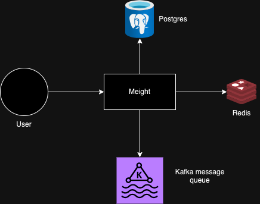

# Meight

A small API to manage trucks and orders and how to track orders that were shipped.

# Architecture
)

## Features

- Generates the best track for a truck based on orders assigned
- Generates events each time an order change a status
- Allows users to assigned orders to truck

## Not included

- Users permissions
- Authentification and Authorization ( expected to be shielded by an API gateway)

## Next steps

- Error unification and custom errors
- Add prometheous metrics and Grafana for monitoring
- Add documentation, like `swagger`
- [CI/CD] Create build and move env variables to CI/CD
- Maybe thinking about adding a DAL, instead of using SQLC generated code as a DAL (This way, we can mock database requests directly)
- ADD E2E tests and performance tests

## Technologies used

- PostgresSQL for database
- Kafka for Message Queue
- Redis for Cache
- `SQLC` for generating sql queries
- `go-migrate` for migrating database schemas
- Golang as a programming language

## Run Locally

Install docker if you don't have it in your machine

Clone the project

```bash
  git clone https://github.com/cfsgoncalves/meight-project.git
```

## Developing 
Go to the project directory and run docker compose

```bash
  cd meight-project && docker compose up --build -d
```

If you want to run without docker compose you should load `test.env` file

```bash
  export $(grep -v '^#' ./configuration/test.env | xargs)
```

Execute a docker compose command to up the dependencies

```bash
  docker compose up --build kafka redis postgres kafka-ui
```

Run the application

```bash
  go run main.go
```

## API Reference

#### Add new truck

```http
  POST /v1/truck
```

| Parameter | Type     | Description                |
| :-------- | :------- | :------------------------- |
| `plate` | `string` | **Required**. The truck plate |
| `max_weight` | `string` | **Required**. The max weight the truck can be |

#### Add new order

```http
  POST /v1/order
```

| Parameter | Type     | Description                       |
| :-------- | :------- | :-------------------------------- |
| `order_code`      | `string` | **Required**. Order code of the package. |
| `weight`      | `float` | **Required**. Weight of the order |
| `latitude`      | `float` | **Required**. Latitude of the order |
| `longitude`      | `float` | **Required**. Longitude of the order |
| `description`      | `string` | Description of the order |

#### List orders that can be assigned

```http
  GET /v1/order
```

#### Assign Orders to a Truck

```http
  POST /v1/orderTruck/:truckPlate
```

| Parameter | Type     | Description                       |
| :-------- | :------- | :-------------------------------- |
| `truckPlate`      | `string` | **Required**. Plate of the truck. |
| -      | `[]string` | **Required**. OrderCodes of the orders that will be assigned . |

#### Update an order shipping status

```http
  PATCH /v1/orderTruck/:truckPlate/:date
```

| Parameter | Type     | Description                       |
| :-------- | :------- | :-------------------------------- |
| `:truckPlate`      | `string` | **Required**. Plate of the truck. |
| `:date`      | `string` | **Required**.  Date that the order was assigned. |
| `status`      | `string` | **Required**.  Status that will be assigned. |
| `order_code`      | `string` | **Required**. Order code of the package. |

#### Update an order shipping status

```http
  GET /v1/orderTruck/:truckPlate/:date
```

| Parameter | Type     | Description                       |
| :-------- | :------- | :-------------------------------- |
| `:truckPlate`      | `string` | **Required**. Plate of the truck. |
| `:date`      | `string` | **Required**.  Date that the orders were assigned. |

#### Health - return true 200 OK if dependencies are up

```http
  GET /health
```

#### Ping - returns 200 OK

```http
  GET /ping
```


